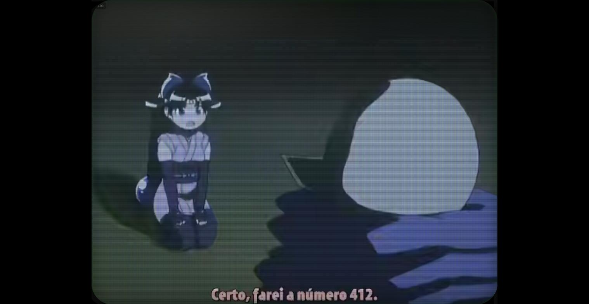
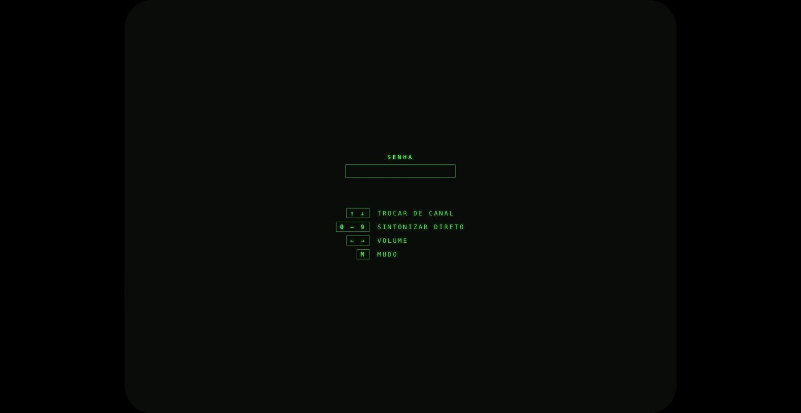

# Retro TV

Transforma uma pasta de desenhos animados em canais de TV ao vivo.

Cada serie do acervo vira um canal que roda 24 horas por dia, tendo alguem
assistindo ou nao. Abrir um canal nao inicia um episodio: sintoniza o que estaria
no ar naquele instante, no meio da cena, e segue para o proximo episodio quando
aquele acaba. Nao ha menu, nao ha grade de biblioteca e nao ha "continuar
assistindo". So trocar de canal.

[English](README.md)


## Como funciona

A grade e uma funcao pura do relogio. Dado um instante zero fixo, a duracao total
da serie e a hora atual, o servidor calcula qual episodio esta no ar e quanto ja
passou dele:

```
ciclo    = soma da duracao de todos os episodios
decorrido = (agora - epoca) mod ciclo
```

Nada sobre posicao de reproducao e guardado. Isso tem tres consequencias uteis:

- Reiniciar o servidor nao mexe na grade. A epoca e o unico estado.
- Duas pessoas abrindo o mesmo canal veem o mesmo quadro.
- Um canal que ninguem assiste ha uma semana esta exatamente onde deveria estar
  quando alguem finalmente sintoniza.

Cada canal e deslocado por um hash estavel do proprio slug, para que os canais
nao estejam todos no episodio 1 ao mesmo tempo.

O navegador busca a posicao atual, mede o tempo de ida e volta para estimar o
desvio de relogio, salta para o offset certo e depois se mantem honesto. A cada
segundo compara a posicao real com a projetada:

| Desvio | Correcao |
| --- | --- |
| abaixo de 300 ms | nenhuma |
| 300 ms a 2 s | velocidade ajustada em 5 por cento ate zerar |
| acima de 2 s | salto direto |

Quinze segundos antes do fim do episodio, o proximo e pre-carregado num segundo
elemento de video, e a troca e uma mudanca de visibilidade em vez de recarga. Sem
buraco preto entre episodios.

Medido num acervo real de 460 canais: o desvio ficou em 163 ms mais ou menos
5 ms ao longo de 30 segundos, bem dentro da banda morta.

## Aparencia

O efeito CRT e CSS e SVG em camadas sobre um elemento `<video>` nativo. Sem
WebGL, sem canvas. Isso mantem o elemento de video real, o que importa para o
cliente Android planejado, e custa quase nada de GPU no cliente.

Camadas, em ordem: scanlines, mascara de fosforo, barra de rolagem, vinheta, grao
animado via `feTurbulence`, flicker de brilho e reflexo de vidro. Tudo controlado
por custom properties em `:root`, entao da para afinar sem tocar nas regras:

```css
--crt-scanline-opacity
--crt-mask-opacity
--crt-grain-opacity
--crt-flicker-amount
--crt-vignette
--crt-phosphor      /* padrao #33ff66 */
```

Adicionar `.crt-off` no container desliga todos os efeitos de uma vez.
`prefers-reduced-motion` desliga o flicker e o grao animado.

A imagem ocupa a altura toda da janela em 4:3. Numa televisao 16:9 isso deixa
tarjas pretas nas laterais, o que esta correto: nada e esticado e nada e cortado.



## Controles

Nao existe menu em lugar nenhum, entao a tela de senha serve tambem de referencia
dos controles.

| Tecla | Acao |
| --- | --- |
| Cima / Baixo | canal anterior ou proximo, dando a volta |
| 0 a 9 | sintoniza direto pelo numero |
| Esquerda / Direita | volume |
| M | mudo |

Digitar numeros funciona como controle remoto antigo: o numero fica pendente por
um instante antes de valer, e vale na hora assim que atinge a largura do maior
numero de canal existente.

O ultimo canal assistido fica no `localStorage`, entao fechar o navegador e
voltar depois cai no mesmo canal em vez de recomecar no um. O valor e validado
contra os canais que existem naquele momento: se a serie tiver saido do acervo
nesse meio tempo, voce cai no primeiro canal em vez de numa tela morta. E a unica
coisa que o app lembra entre sessoes.



### Autoplay

A imagem sempre comeca sozinha. O som e outra historia: navegador recusa tocar
audio antes de o usuario ter interagido com a pagina, e essa regra nao tem como
ser contornada por JavaScript.

Entao o player tenta com som e, se o navegador recusar, entra mudo na hora em vez
de deixar um quadro parado na tela. A primeira tecla ou clique devolve o som. Um
aviso curto de `SEM SOM` aparece quando isso acontece.

Numa maquina dedicada a isso, suba o navegador com a politica desligada e o som
funciona desde o primeiro quadro, sem interacao nenhuma:

```
chromium --kiosk --autoplay-policy=no-user-gesture-required http://seu-host/
```

O Chrome tambem libera o autoplay sozinho depois que voce assiste o bastante numa
origem, entao um navegador de uso frequente para de pedir com o tempo.

## Organizacao do acervo

Estes dois formatos sao entendidos, e uma mesma serie pode misturar os dois:

```
ACERVO/
  Nome da Serie/
    episodio 01.mp4
    episodio 02.mp4

  Outra Serie/
    1a Temporada/
      episodio 01.mp4
    2a Temporada/
      episodio 01.mp4
```

Aninhamento mais profundo tambem funciona. Tudo que estiver abaixo de uma pasta
de primeiro nivel e coletado recursivamente e ordenado por natural sort do
caminho, entao uma coletanea com sub colecoes vira um canal so em vez de varios.

Pastas de temporada sao reconhecidas nos formatos que aparecem de verdade,
incluindo a convencao brasileira em que o numero vem antes: `1a Temporada`,
`2 Temporada`, `1a.Temporada.1959-1960`, `10a Season`, `Temporada 4`, `Season 5`,
`S06`, `T07`, e ordinais por extenso como `Terceira Temporada`.

Numero de episodio e de temporada sao melhor esforco. Quando o nome do arquivo
nao da nada confiavel, os campos ficam nulos em vez de serem inventados, ja que
quem manda na reproducao e a posicao na grade.

Arquivos ocultos, `@eaDir`, `.AppleDouble` e `#recycle` sao ignorados. Uma serie
cujos arquivos falham todos no probe nao vira canal, porque um canal vazio faria
a grade dividir por zero.

## Codecs

Nao ha transcodificacao. Os arquivos saem direto do disco com HTTP range, que e a
unica escolha sensata num NAS sem GPU.

Isso funciona porque se espera que o navegador decodifique a origem diretamente.
AV1 em MP4 decodifica por software em todo Chrome atual e nativamente no Android.
H.265 so toca onde o sistema operacional expoe um decodificador de hardware,
entao um acervo pesado em H.265 pode nao sobreviver ao direct play em todo
cliente.

Verifique o seu antes de assumir:

```
npm run survey -- "/caminho/do/acervo"
```

Ele relata a distribuicao de codecs, a de containers, quantos arquivos trazem o
atomo `moov` na frente (que e o que torna rapido o salto para o meio do arquivo)
e um veredito claro sobre a viabilidade do direct play.

## Requisitos

- Node 22 ou mais novo
- `ffprobe` no PATH, para a indexacao
- Um acervo de arquivos de video

## Comeco rapido

```bash
npm install
cp .env.example .env
```

Gere os dois segredos e coloque no `.env`:

```bash
openssl rand -hex 32        # SESSION_SECRET
npm run hash-password       # AUTH_PASSWORD_HASH
```

Indexe o acervo. Este e o unico passo caro, porque roda `ffprobe` uma vez por
arquivo. Uma segunda execucao e quase instantanea, porque o resultado e cacheado
por data de modificacao e tamanho:

```bash
npm run scan -- "/caminho/do/acervo"
```

Este comando e opcional. Com o indice vazio, o servidor indexa o acervo sozinho,
em segundo plano, sem atrasar o boot. E o caminho normal num deploy em container,
onde nao ha shell para rodar comando. Dentro do container o binario do scan e o
compilado, porque o `tsx` e dependencia de desenvolvimento e nao vai na imagem:

```bash
docker compose exec retro-tv node dist/server/scan.js /media/desenhos
```

Depois rode:

```bash
npm run dev      # Vite na 5173, API na 8080
```

Para producao:

```bash
npm run build
npm start
```

## Configuracao

| Variavel | Significado |
| --- | --- |
| `LIBRARY_ROOT` | Pasta raiz do acervo |
| `DATA_DIR` | Onde fica o indice SQLite. Precisa ser gravavel. Nao deixe em branco: em branco vira caminho relativo, que dentro do container e `/app/data`, sem volume e sem permissao de escrita |
| `AUTO_SCAN` | Indexa o acervo sozinho quando o indice esta vazio. So a string exata `false` desliga |
| `DISPLAY_MODE` | `crt` (padrao) mantem o visual 4:3 com filtro CRT. `widescreen` muda os clientes para 16:9 sem o filtro, com lista de canais e catalogo sob demanda — para acervos FullHD/4K |
| `PORT` | Porta HTTP, padrao 8080 |
| `CHANNEL_EPOCH` | Instante zero da grade. Mudar reposiciona todos os canais de uma vez |
| `AUTH_PASSWORD_HASH` | Saida de `npm run hash-password` |
| `SESSION_SECRET` | 32 bytes ou mais de aleatoriedade, assina o cookie de sessao |
| `SECURE_COOKIES` | `false` apenas para HTTP local. Qualquer outra coisa mantem a flag `Secure` |

O `.env` e lido uma vez, no boot. Trocar a senha no arquivo nao muda nada ate o
processo reiniciar, e isso na tela parece exatamente uma senha errada. O
`npm run dev` observa o `.env` e reinicia sozinho; um container de producao
precisa de `docker compose up -d --force-recreate`.

`AUTH_PASSWORD_HASH` guarda o hash, nao a senha. Colar a senha em texto claro ali
fazia o servidor subir normalmente e recusar a senha certa, entao agora ele se
recusa a subir e diz o motivo.

## Deploy

`docker compose up` constroi e sobe com o acervo montado somente leitura e o
indice num volume nomeado. Veja [docs/DEPLOY.md](docs/DEPLOY.md) para o passo a
passo no TrueNAS SCALE e a configuracao de reverse proxy.

Vale repetir aqui: se voce expuser isso para fora da sua rede local, ponha HTTPS
na frente. Sem TLS a senha e o cookie de sessao trafegam em texto claro. O
compose publica em `127.0.0.1` por padrao exatamente por causa disso.

## Seguranca

O acesso e uma senha unica, com hash scrypt e comparacao em tempo constante. O
cookie de sessao e stateless, assinado com HMAC-SHA256, `HttpOnly` e
`SameSite=Lax`, e carrega o proprio instante de emissao dentro da area assinada,
entao a expiracao nao pode ser adiada pelo cliente. Falhas repetidas vindas do
mesmo endereco ficam bloqueadas por quinze minutos.

Isso e uma fechadura numa porta, nao uma fortaleza. Serve para um servidor de
midia pessoal atras de um reverse proxy. Nao e um sistema de autenticacao para
varios usuarios e nao finge ser.

## Estrutura do projeto

```
src/
  shared/     tipos do contrato da API, usados por servidor e cliente
  server/
    library/  scanner, wrapper de ffprobe, indice SQLite, job de scan
    schedule/ clock.ts, a funcao pura por tras de tudo
    channels/ mapeia o indice em canais, rotas HTTP
    stream/   parsing de range e entrega do arquivo
    auth/     hash de senha, cookie de sessao, rotas
    cli/      scan, survey, hash-password
  web/
    sync.ts   desvio de relogio e correcao de deriva, puro
    tuner.ts  teclado para numero de canal, reducer puro
    player.ts elementos de video, preload e troca
    crt/      a skin CRT
```

A logica interessante e deliberadamente pura e mora longe do I/O: `clock.ts`,
`sync.ts`, `tuner.ts`, `osd.ts` e `range.ts` nao tem filesystem, nao tem DOM e
nao tem `Date.now()`. E isso que torna a grade testavel nas bordas, que e onde
uma grade ao vivo realmente quebra.

## Testes

```bash
npm test
npm run typecheck
```

382 testes. O relogio esta coberto em toda fronteira que importa: o instante
exato entre dois episodios, a volta do loop, uma epoca no futuro, uma serie de um
episodio so e um ciclo de 300 episodios rodando por varias voltas.

## Android

Ainda nao construido. O cliente nao guarda estado de negocio e a API e a unica
fonte de verdade, entao o caminho e envelopar o cliente web ou escrever um
cliente nativo contra os mesmos endpoints. Nada na API e especifico de navegador.

## Licenca

Ainda nao ha arquivo de licenca. Adicione um antes de publicar, se voce se
importa com o que os outros podem fazer com isso.
